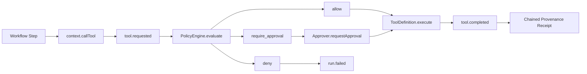

# Architecture

`ajnas-runtime` is intentionally small. It owns the execution contracts that remain consistent across the Ajnas packages:

1. Workflow execution
2. Tool dispatch
3. Policy evaluation
4. Human approval checkpoints
5. Provenance receipt emission
6. Run snapshot persistence

## Data Flow

## Package Boundaries

- Runtime keeps only local execution contracts.
- `ajnas-policy` provides reusable declarative policy engines.
- `ajnas-provenance` adds signed evidence bundles and export formats; remote ledger persistence remains a host concern.
- `ajnas-approvals` provides transport-neutral approval workflows; Slack, email, and web delivery remain host integrations.
- `ajnas-connectors` provides manifests, trust evaluation, and invocation metadata; transport implementations remain adapters.

## Design Choices

- Policy runs before every tool execution.
- Approval is explicit and typed; no prompt-only approval is accepted.
- Events are hash chained in runtime order.
- Run snapshots are plain JSON so CI, audits, and future dashboards can inspect them without a service dependency.
- The package has no production dependencies.
