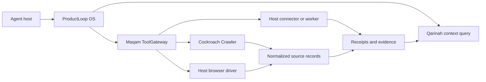

# Governed agent stack

ProductLoop OS is the composition layer for a system with four explicit responsibilities:

1. ProductLoop OS composes workflows and portable governance records.
2. Qarinah compiles approved project history into bounded, cited context.
3. Maqam governs registered operations at the real side-effect boundary.
4. Cockroach Crawler collects bounded public evidence through declared source contracts.

The order is logical, not a forced call sequence. A workflow may query context before planning, collect public evidence during execution, or record an approved outcome afterward. The invariant is that the real operation must pass through the boundary that claims to govern it.



## Current capability map

| Capability | Provider | No-key baseline | Configuration needed | Claim limit |
| --- | --- | --- | --- | --- |
| Crawl explicit public HTTP(S) URLs | Cockroach Crawler | Yes | None | Not general web search and not access-control bypass |
| Search/read public GitHub data | Cockroach Crawler prerelease | Yes | Token optional for higher documented REST limits | Read-only and rate-limited |
| Read a known YouTube video | Cockroach Crawler prerelease | Public metadata | API key for search and richer metadata | No transcript support in Cockroach Crawler |
| Parse RSS/Atom | Maqam | Yes, after governed retrieval | Host-supplied reader | Parser performs no network access |
| Read available YouTube captions | Maqam | No developer key when a reviewed `yt-dlp` executable is available | Explicit executable path and host controls | Availability depends on the video, region, and upstream tool |
| Hosted-anonymous web search | Maqam adapter contract | Can be available without a developer-owned key | Explicit host-selected adapter and terms review | Not a universal free-search guarantee |
| Natural-language browser action | Maqam browser contract plus host driver | No built-in model or driver | Browser engine, model provider, allowed origins, structural preview/apply contract | Browser isolation and credentials remain host responsibilities |
| Exact approval and one-use execution | Maqam | Yes | Registered tool route and approval store | Direct calls bypass the boundary |
| Workflow, policy, approvals, evals, and provenance | ProductLoop OS | Yes | Application policy and durable stores for production | In-process records are not an OS sandbox |
| Compact evidence-linked project context | Qarinah | Yes in local alpha | Explicit workspace consent and machine trust | Private alpha; no public package claim yet |

## What was learned from adjacent open-source tools

Broad capability installers make setup legible through one command, a doctor, ordered fallbacks, and an honest ready/blocked matrix. In-page GUI agents show that natural-language form and navigation control can be integrated behind a small driver surface. Project knowledge graphs show that relationship-aware retrieval can reduce repeated repository scanning.

This stack uses those product lessons without importing their brands or pretending to provide identical implementations. Its differentiator is the connection between:

- bounded source acquisition;
- exact approval tied to canonical tool input;
- deterministic evidence and provenance;
- compact context linked back to source events; and
- replaceable host adapters whose bypass paths remain visible.

No upstream implementation is a dependency of ProductLoop OS, Maqam, Cockroach Crawler, or Qarinah merely because it appears in comparison or provenance documentation. Any future code import requires an exact source revision, license review, notices, tests, and a documented modification record.

## Installation truth

The public components are installed independently today:

```sh
npm install productloop-os maqam cockroach-crawler
```

Qarinah must not be added to public install instructions while its repository remains private and unlicensed. A future single installer may validate and connect the packages, but it must keep every capability opt-in, print the exact status of external dependencies, and never capture context or credentials by default.

## Launch gates for one-install distribution

- publish one versioned stack manifest that names component versions and compatibility ranges;
- add a doctor that distinguishes installed modules from live external capabilities;
- ship one deterministic demo that performs a bounded read, exact approval, replay rejection, evidence import, and context query;
- preserve separate read, write, browser, credential, and context-disclosure permissions;
- provide clean install, upgrade, uninstall, and rollback checks on Node 22, 24, and 26;
- keep Qarinah opt-in and metadata-only by default;
- publish no universal no-key, browser-control, or operating-system-governance claim without matching evidence.

## Product boundary

This is an agent governance and context control plane, not an AI operating system today. The credible path toward an agentic layer across Windows, macOS, and Linux is to add host supervisors and OS-native adapters behind Maqam, while ProductLoop preserves policy and evidence and Qarinah preserves approved context. Hard isolation still belongs to operating-system accounts, sandboxes, containers, virtual machines, endpoint controls, and platform authorization.
