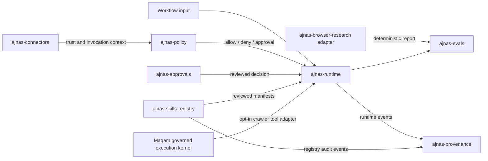

# ProductLoop OS architecture

ProductLoop OS is the ecosystem and runtime companion to [Maqam](https://maqamagent.com), the governed execution kernel. ProductLoop composes independently usable packages around that kernel; the umbrella does not merge their stores, silently translate every record, or intercept calls made outside its runtimes. It creates explicit adapters only where documented schemas are compatible and keeps the original module namespaces available when an application needs lower-level control.

See the [Maqam and ProductLoop guide](./maqam-and-productloop.md) for the product boundary and installation choices, or browse the public [package atlas](https://maqamagent.com/docs/productloop/).

## Default composition

`createProductLoopOS()` creates:

- one runtime tool registry and in-memory runtime event sink;
- a declarative policy engine and decision ledger;
- an approval queue;
- a connector registry with a hash-chained audit ledger;
- a skill registry with its audit ledger;
- a general provenance trace ledger;
- a browser-research audit ledger;
- Maqam policy, evidence, approval, gateway, and runtime instances.

The ProductLoop runtime uses a deny-by-default declarative bundle unless the caller supplies a policy bundle or an explicit runtime policy adapter. Standalone `ajnas-runtime` also denies tool calls when no policy engine is configured. A tool's declared risk is metadata, not a sandbox; applications must still enforce the real permission boundary.

The Maqam subsystem remains separate because its workflow, policy, approval, evidence, and tool contracts are not identical to the smaller Ajnas packages. The umbrella exposes both systems and a `createMaqamCrawlerTool()` adapter that turns Maqam's crawler into an `ajnas-runtime` high-risk tool. It is never registered or executed automatically. This is a tested package adapter, not a claim that ProductLoop natively integrates every Maqam capability or any external provider.

## Tested bridges

The umbrella owns a small number of explicit bridges:

- `adaptPolicyEngine()` maps an `ajnas-policy` engine to the `ajnas-runtime` policy contract without passing executable tool functions into policy data.
- `importRuntimeEvents()` imports hash-receipted runtime events into the general trace ledger and de-duplicates them by event hash.
- `importSkillAuditEvents()` imports registry audit events into the same trace ledger and de-duplicates them by event hash.
- `runtimeSnapshotToEvalArtifact()` maps a runtime snapshot and optional trace into the evidence shape consumed by `ajnas-evals`.
- `browserReportToEvalArtifact()` maps deterministic browser-research reports, step evidence, and verification results into an eval artifact.
- Existing package adapters remain available for connector trust to policy, policy decisions to approval subjects, and approved tickets back to runtime decisions.

These bridges copy evidence; they do not create distributed transactions. If a process stops between two writes, the caller must retry the import or use a durable outbox around the operation.

## External boundaries

The following capabilities are deliberately provided by callers or deployment infrastructure:

- model inference and prompt management;
- a live browser or search provider for `ajnas-browser-research`;
- connector transport implementations and secret resolution;
- sandboxing and operating-system permissions;
- durable queues, databases, locks, and distributed scheduling;
- identity, authentication, authorization, and reviewer directories;
- telemetry export, retention, and incident response.

Maqam contains an HTTP crawler and CLI-agent process adapters. Those are real side effects and must be governed with network, filesystem, command, and credential controls outside the in-process policy objects.

Any provider, browser, connector, model SDK, or Maqam call made directly outside the chosen governed runtime bypasses that runtime's policy, approval, and evidence path. A host application must route the real side effect through the relevant gateway or registered tool and enforce infrastructure controls at the execution boundary.
